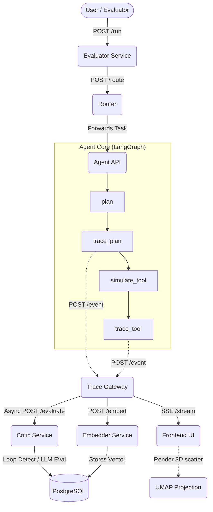

# Agent Glass: System Architecture & Data Flow

## 1. High-Level Summary
The main objective of this application is to scientifically observe, evaluate, and sandbox LLM agents. The architecture acts as a highly monitored proxy between a naive LLM Agent and its execution environment, passing every intermediate thought and action through an AI Critic.

## 2. Microservice Breakdown

### `agent` (LangGraph Core)
- **Role:** The actual LLM acting on user prompts. Implemented via LangGraph to enforce state progression.
- **Data Flow:** Instead of executing code right away, it emits structured traces (`trace_plan`, `trace_tool`) to the Trace Gateway, yielding control to the system asynchronously before it commits actions.

### `critic` (Safety Gatekeeper)
- **Role:** An independent LLM evaluator that intercepts trace events from the gateway. 
- **Decisions:** It uses a structured system prompt to analyze the payload intentionally, returning `approve`, `modify`, or `deny` paired with a color-coded Flag and a Threat Class.
- **Loop Backstop:** Explicitly looks backwards in the database at previous turns to prevent infinite execution loops caused by LLM stubbornness.

### `trace-gateway` (The Brain Trunk)
- **Role:** The central nervous system. It ingests all events from the Agent, stores them in PostgreSQL, orchestrates asynchronous jobs (embedding and critiquing), and broadcasts live Server-Sent Events (SSE) to connected UI clients.
- **Endpoints:** Handles `GET /stream` for web clients and `GET /visualization/umap` for returning dimensionality-reduced 3D coordinate pairs.

### `embedder` (Vector Engine)
- **Role:** Translates natural language traces and prompts into 4096-dimensional mathematical vectors using `nvidia/nv-embed-v1` via the NVIDIA NIM API. These vectors capture the semantic and structural layout of the attacks for later clustering analysis.

### `frontend` (Dashboard)
- **Role:** Pure HTML/JS/CSS client containing zero state logic. Fetches traces dynamically over websockets and uses Plotly.js to render complex visualizations (UMAP) seamlessly in the browser. 

### `evaluator` & `synthetic-gen` (Testing Arms)
- **Role:** Runs benchmarks (GAIA, Malicious sets) continuously to grade the Critic's resilience. Does not serve production traffic.
